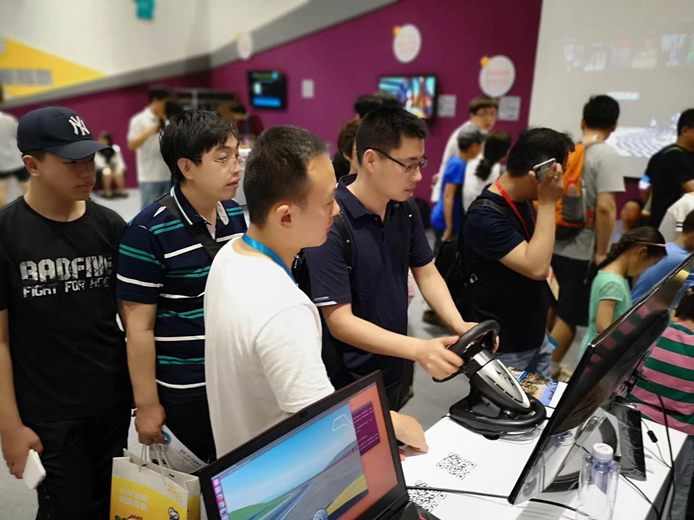
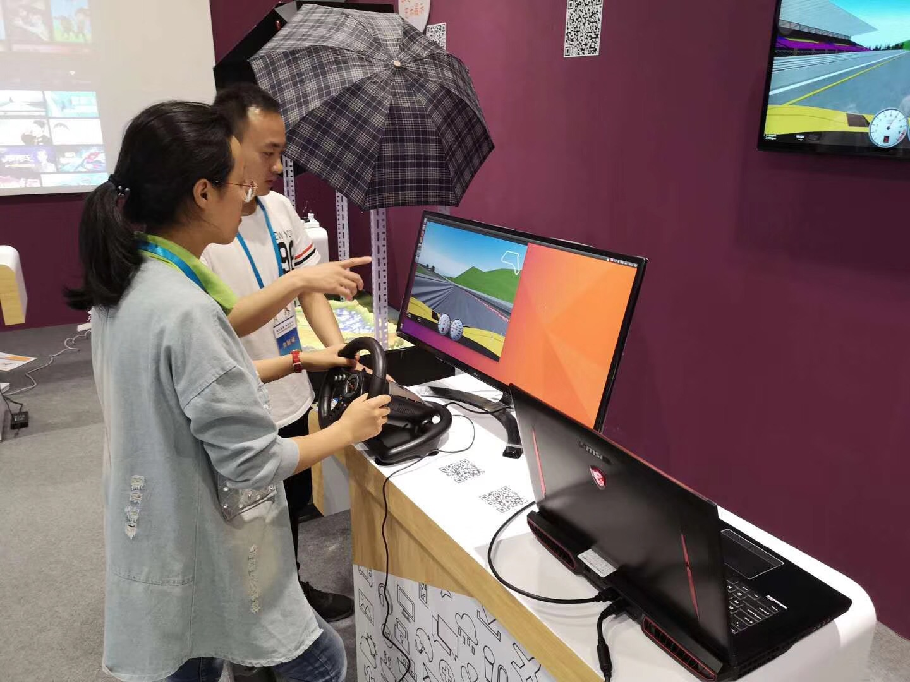

## Autonomous Driving Experience Platorm Exhibition

The developed autonomous driving experience platorm was exhibited in the 2018 Beijing Science and Technology Week from 19~26 May. There are over 120 thousands viewers participated[1]. The developed experience platform is very popular and some exhibition photos are shown below.

  

[1] http://www.xinhuanet.com/tech/2018-05/26/c_1122892164.htm (accessed 27 June 2018, in Chinese)
